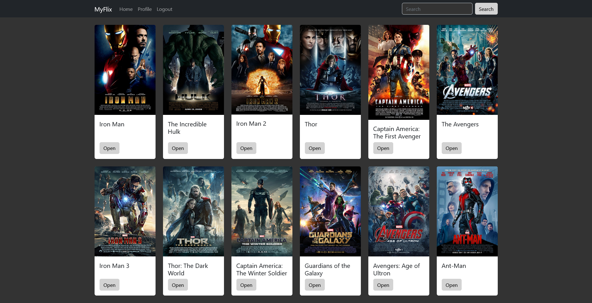

# MyFlix Movie Database Client

This React single page application is the frontend for the [movie-api backend](https://github.com/Schlumen/movie-api).
You can register an account, login, modify your account details, delete your account, see all movies from the database, search for movies, see movie details, add movies to your list of favorites and delete movies from your list of favorites.

## Used technologies

- React
- React Bootstrap
- JavaScript
- HTML
- CSS/SCSS

## Link to the live version

The online hosted version of this app can be found here: [MyFlix](https://myflix.haendler.dev)